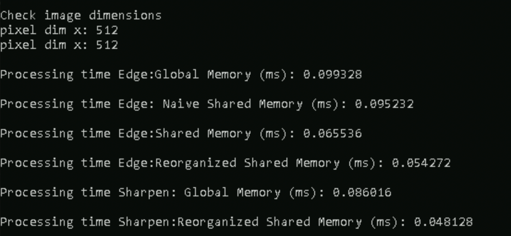

# **Objective:**
Developed a custom CUDA kernel for Image Filtering with parallel GPU based algorithms.  I implemented two filtering techniqoes: Sobel Edge detection
filter and Sharpening filter, which can be extended to any convolution filter.

Integrating the custom CUDA kernel with PyTorch, a popular deep learning framework, allows us to seamlessly
incorporate the GPU-accelerated image flipping operation into deep learning workflows. PyTorch provides a conve-
nient interface for building and training neural networks, and integrating CUDA kernels with PyTorch enables us to
perform image filtering directly within PyTorch tensors.

Normally we use RGB images which have three channels and 1024*1024 pixels. By using parallel processing we
can make any pixel-wise manipulation faster. Though Pytorch have a lot of functionalities that use CUDA, by using
this same technique we can use any custom function tailored to our need.

By using Pybind with this, we can create a powerful and efficient solution for any image processing techniques
using parallel GPU-based algorithms and seamlessly integrate it with PyTorch.
# **Description:**
For Sobel Edge Detection, I implemented four different methods: one global memory tecgniques and three shared memory approach. For sharpening filter, I implemented global and shared memory approcah. 

We can see how there is a 45% increase in processing time from global memory approach to my approach. For details on the algorithm, refer the Convolution_CUDA.pdf. 
The code is in the src directory under the name ex.cu. You need to have libtorch and opencv installed and add their path to the path variables.
